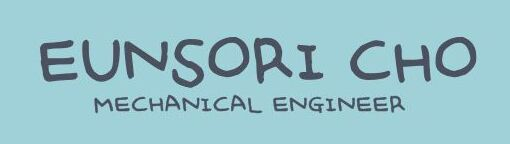

## Hi there 👋  

Mechanical Engineering student at Hanyang University.  
Former exchange student at ZHAW (Switzerland).

## 🔍 Interests
- Mechanical & Product Design
- Robotics and Automotive Systems
- Practical, efficient, and well-structured engineering solutions

## 🛠️ Skills & Tools

### CAD / Design

### Programming

